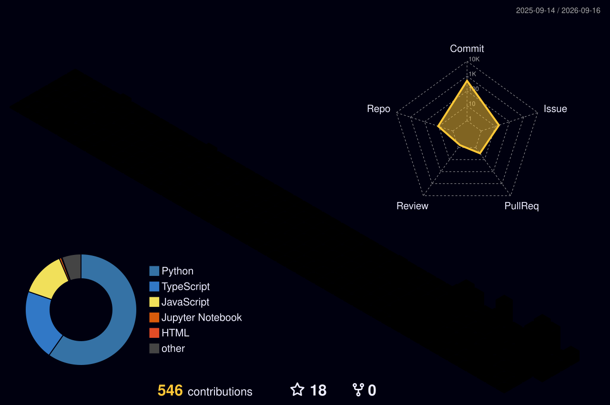

  

  

   

  
  
  
  

 

  
  
  
  

 

  

## Live Board

  
  
  

  
  

  

## Systems

<table>
  <tr>
    <td align="center" width="25%">
       
      <b>Agent Backends</b> 
      tools, memory, workers, APIs
    </td>
    <td align="center" width="25%">
       
      <b>Productivity UI</b> 
      extensions, panels, analytics
    </td>
    <td align="center" width="25%">
       
      <b>Learning Tools</b> 
      resource flows, progress, students
    </td>
    <td align="center" width="25%">
       
      <b>Engineering Hygiene</b> 
      docs, config, repo polish
    </td>
  </tr>
</table>

## Featured Repos

  
  

  
  

## Motion

  <picture>
    <source media="(prefers-color-scheme: dark)" srcset="https://raw.githubusercontent.com/Narendarcodes/Narendarcodes/output/github-contribution-grid-snake-dark.svg" />
    <source media="(prefers-color-scheme: light)" srcset="https://raw.githubusercontent.com/Narendarcodes/Narendarcodes/output/github-contribution-grid-snake.svg" />
    
  </picture>

  

