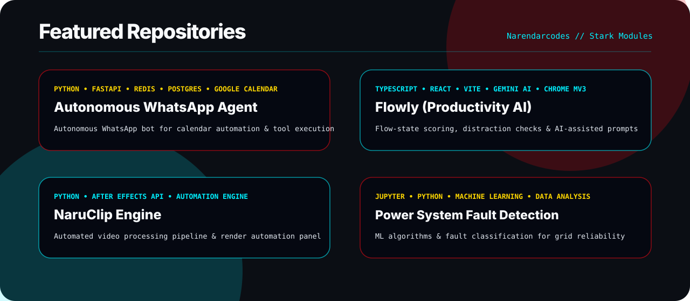

<div align="center">
  

  <br />

  <a href="mailto:gollanarendar2004@gmail.com"></a>
  <a href="https://www.linkedin.com/in/golla-narendar/"></a>
  <a href="https://github.com/Narendarcodes"></a>
  
</div>

<br />

```text
+-----------------------------------------------------------------------------------+
|  STARK_OS // AGENTIC_AI_DIAGNOSTICS [ONLINE]                                      |
|  OPERATOR : Golla Narendar (CBIT '28 | GPTM '25)                                 |
|  PRIMARY  : Agentic AI Systems | ML Pipelines | LLM Orchestration                 |
|  LOCATION : Hyderabad, India                                                      |
+-----------------------------------------------------------------------------------+
```

<br />

## 🛡️ Tactical Modules & Systems

<table>
  <tr>
    <td align="center" width="25%">
      <br />
      <b style="color:#00F0FF;">[01] AGENT BACKEND</b><br />
      <sub>FastAPI, Memory, Workers</sub>
    </td>
    <td align="center" width="25%">
      <br />
      <b style="color:#00F0FF;">[02] HUD INTERFACE</b><br />
      <sub>TypeScript, React, Extensions</sub>
    </td>
    <td align="center" width="25%">
      <br />
      <b style="color:#00F0FF;">[03] AI ENGINE</b><br />
      <sub>PyTorch, LLM Tools</sub>
    </td>
    <td align="center" width="25%">
      <br />
      <b style="color:#00F0FF;">[04] CORE PROTOCOLS</b><br />
      <sub>Git, Engineering, Docs</sub>
    </td>
  </tr>
</table>

## ⚡ Active Deployments (Featured Repos)

<p align="center">
  
</p>

<p align="center">
  <a href="https://github.com/Narendarcodes/Autonomous-Whatsapp-Agent">Autonomous WhatsApp Agent</a>
  ·
  <a href="https://github.com/Narendarcodes/Flowly-Be-Productive-With-AI">Flowly</a>
  ·
  <a href="https://github.com/Narendarcodes/NaruClip-Engine">NaruClip Engine</a>
  ·
  <a href="https://github.com/Narendarcodes/power-system-fault-detection">Power System Fault Detection</a>
</p>

## 📊 Telemetry & Metrics

<p align="center">
  
  
</p>

<p align="center">
  
</p>

## Motion

<p align="center">
  <picture>
    <source media="(prefers-color-scheme: dark)" srcset="https://raw.githubusercontent.com/Narendarcodes/Narendarcodes/output/github-contribution-grid-snake-dark.svg" />
    <source media="(prefers-color-scheme: light)" srcset="https://raw.githubusercontent.com/Narendarcodes/Narendarcodes/output/github-contribution-grid-snake.svg" />
    
  </picture>
</p>

