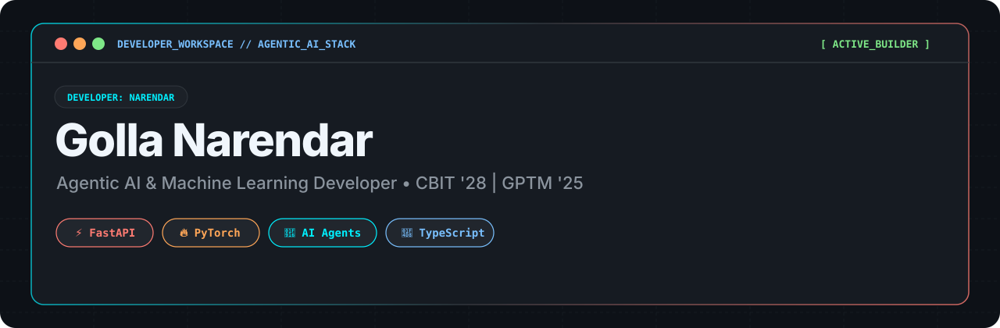
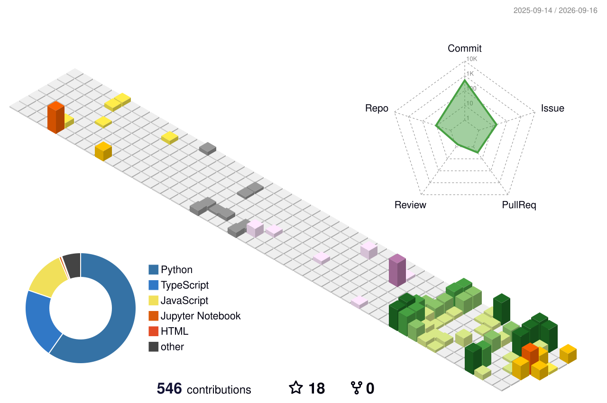
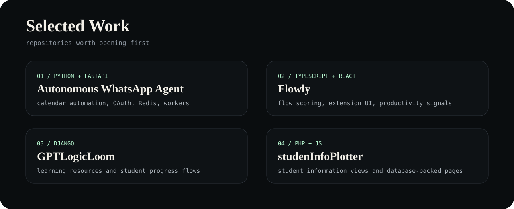

  

  
  
  

  AI agents · backend automation · browser productivity · learning systems

  

## Workbench

  
  
  

  

## Stack

  

<table>
  <tr>
    <td align="center" width="25%"><b>agents</b> tools / memory / workflows</td>
    <td align="center" width="25%"><b>backends</b> APIs / queues / databases</td>
    <td align="center" width="25%"><b>interfaces</b> extensions / panels / analytics</td>
    <td align="center" width="25%"><b>systems</b> docs / config / repo polish</td>
  </tr>
</table>

## Selected Work

  

  <a href="https://github.com/Narendarcodes/Autonomous-Whatsapp-Agent">Autonomous WhatsApp Agent</a>
  ·
  <a href="https://github.com/Narendarcodes/Flowly-Be-Productive-With-AI">Flowly</a>
  ·
  <a href="https://github.com/Narendarcodes/gptlogicloom">GPTLogicLoom</a>
  ·
  <a href="https://github.com/Narendarcodes/studenInfoPlotter">studenInfoPlotter</a>

## Motion

  <picture>
    <source media="(prefers-color-scheme: dark)" srcset="https://raw.githubusercontent.com/Narendarcodes/Narendarcodes/output/github-contribution-grid-snake-dark.svg" />
    <source media="(prefers-color-scheme: light)" srcset="https://raw.githubusercontent.com/Narendarcodes/Narendarcodes/output/github-contribution-grid-snake.svg" />
    
  </picture>

