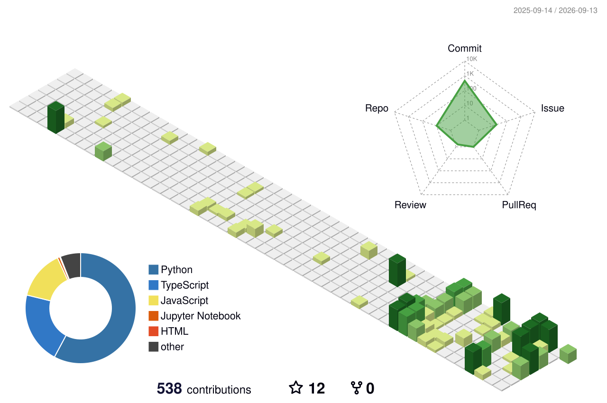

  
  

  
  
  

  

## Stack

  

<table>
  <tr>
    <td align="center" width="25%"><b>agent systems</b> tool calls / memory / workers</td>
    <td align="center" width="25%"><b>backend APIs</b> FastAPI / queues / databases</td>
    <td align="center" width="25%"><b>productivity UI</b> extensions / panels / analytics</td>
    <td align="center" width="25%"><b>learning tools</b> resources / progress / student flows</td>
  </tr>
</table>

## Analytics

  
  

  

## Selected Work

  

  <a href="https://github.com/Narendarcodes/Autonomous-Whatsapp-Agent">Autonomous WhatsApp Agent</a>
  ·
  <a href="https://github.com/Narendarcodes/Flowly-Be-Productive-With-AI">Flowly</a>
  ·
  <a href="https://github.com/Narendarcodes/gptlogicloom">GPTLogicLoom</a>
  ·
  <a href="https://github.com/Narendarcodes/studenInfoPlotter">studenInfoPlotter</a>

